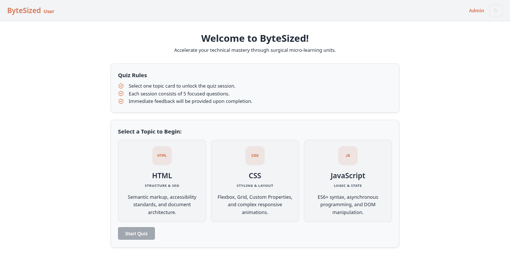
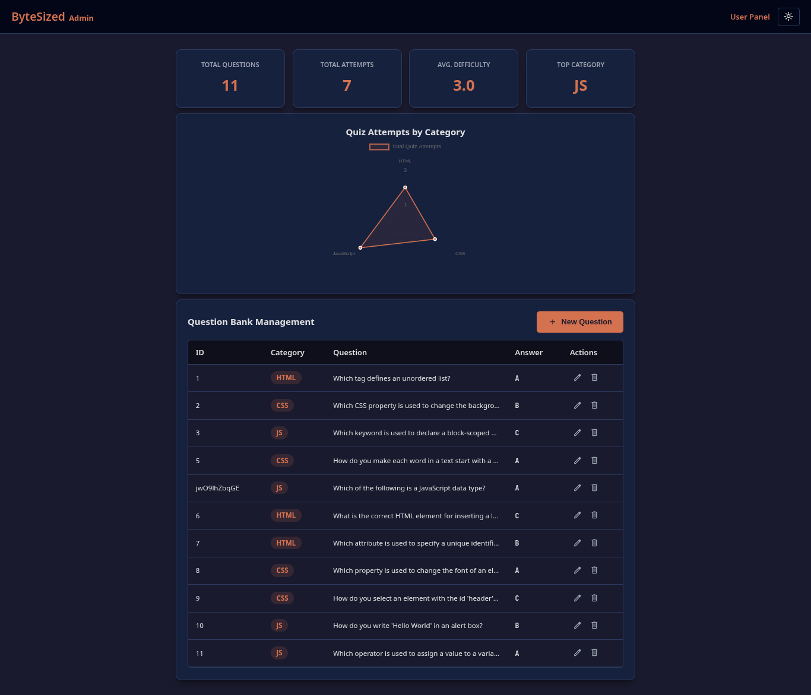
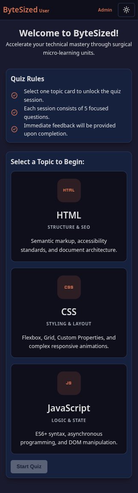
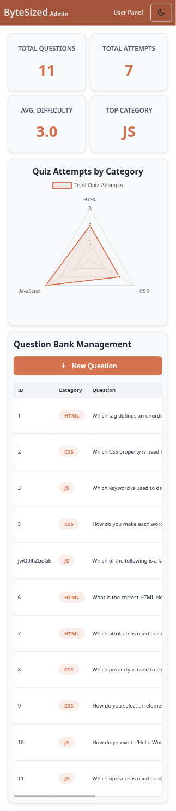

# ByteSized - Web Dev Micro-Learning App

**Web Technologies SP26 - Capstone Project**

**Student Name:** Muhammad Umer Khan

**Roll Number:** F24BDOCS1M01055

**Section:** 4th Semester - 2M

## Overview

ByteSized is a client-side web application designed to test and manage web development knowledge (HTML, CSS, JavaScript). It operates purely on Vanilla JavaScript and custom CSS, utilizing json-server as a mock REST backend.

## What’s Included

- `index.html` - Student-facing quiz interface
- `admin.html` - Admin dashboard for managing question bank and viewing analytics
- `app.js` - User quiz flow, fetch logic, score tracking, and result submission
- `admin.js` - Admin CRUD operations for questions, deletion confirmation, and dashboard stats
- `style.css` - Shared styling, layout, responsive design, and theme support
- `db.json` - Mock backend data for `questions` and `results`

## Setup and Run

### Prerequisites

- Node.js installed
- A modern browser

### Clone the Repository

```bash
git clone https://github.com/MUmer24/ByteSized-Micro-Learning-App.git
cd ByteSized
```

### Install JSON Server

```bash
npm install -g json-server
```

> If you prefer not to install globally, you can use `npx json-server`.

### Start the Mock Backend

From the project root:

```bash
npx json-server --watch db.json --port 3000
```

The backend will run at:

- `http://localhost:3000/questions`
- `http://localhost:3000/results`

### Open the App

Open the files directly in your browser:

- `index.html` for the User Panel
- `admin.html` for the Admin Dashboard

Or using live server open at port 5500 `http://localhost:5500/index.html` and `http://localhost:5500/admin.html`.

## Features

### User Panel

- Topic selection for HTML, CSS, or JavaScript quizzes
- Loads category-specific questions from the JSON Server backend
- Tracks current question progress and score dynamically
- Displays final score and total question count after quiz completion
- Validates student form fields before submitting results
- Sends quiz results to `POST /results`
- Supports light/dark theme toggle that persists in `localStorage`

### Admin Panel

- Fetches full question bank from `GET /questions`
- Displays questions in a responsive table with edit/delete controls
- Adds new questions with `POST /questions`
- Updates existing questions with `PUT /questions/:id`
- Deletes questions with a confirmation modal and `DELETE /questions/:id`
- Calculates dashboard stats from stored results
- Renders a Chart.js radar chart of quiz attempts by category
- Preserves theme preference using `localStorage`


## **📸 Screenshots**

**1\. User Panel (Light Mode)**


**2\. Admin Panel (Dark Mode)**



**3\. Mobile View**

 |

